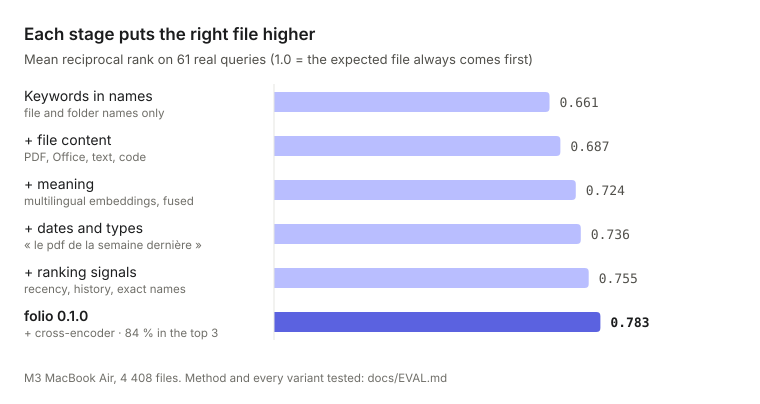
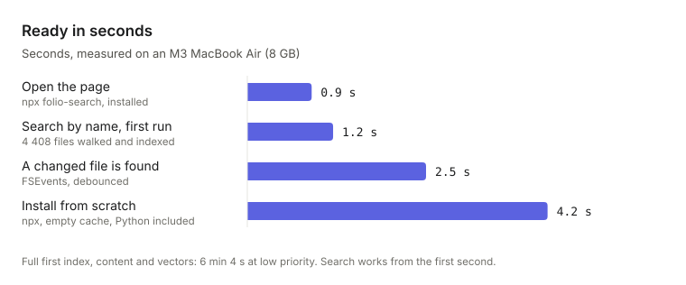

<div align="center">


### Find a file by describing what you remember about it.

[](https://github.com/ethanbch/folio/actions/workflows/ci.yml)
[](https://www.npmjs.com/package/folio-search)
[](LICENSE)
[](#nothing-leaves-your-mac)

</div>

---

You rarely remember a file's name. You remember that it was a quote for the
kitchen, that it mentioned solid oak, that it arrived last week as a PDF.
**folio searches the way you remember**: by name, by folder and by what is
inside the file, in French and English, on your Mac and nowhere else.

```sh
npx folio-search
```

Installs in about 4 seconds, then opens in under 1. One click indexes your Documents,
Desktop, Downloads and iCloud Drive.


<table>
<tr>
<td align="center" width="25%"><h3>84 %</h3>of searches put the right file<br>in the top 3</td>
<td align="center" width="25%"><h3>12 ms</h3>for the first results,<br>as you type</td>
<td align="center" width="25%"><h3>1.2 s</h3>until you can search<br>4 408 files by name</td>
<td align="center" width="25%"><h3>100 % local</h3>no account, no telemetry,<br>files never uploaded</td>
</tr>
</table>

## Search the way you remember

Type what comes to mind. folio reads it as you would:

| You type | folio understands |
| --- | --- |
| `le devis de la cuisine en chêne` | a quote, about a kitchen, that mentions oak |
| `le pdf de la semaine dernière` | PDF files, modified or opened since Monday of last week |
| `slides du cours sur la VaR` | presentations, from a course, about Value at Risk |
| `notes réunion budget mars 2025` | meeting notes on the budget, from March 2025 |

Dates and file types in the query become filters you can remove with one
click. The rest is matched three ways at once: by **keywords** in names,
folders and content, by **meaning** with a multilingual language model, and by
**what you opened before**. A cross-encoder then re-reads the top 10 to put the
right file first.

## Each stage is measured

Every part of the ranking was added, tuned or rejected against 61 real queries
with known answers. Ideas that did not improve the numbers were left out: hard
date filters and split keyword lists ranked worse, and an embedding model 2.4
times larger ranked no better.

<picture>
  <source media="(prefers-color-scheme: dark)" srcset="docs/charts/quality-dark.svg">
  
</picture>

| Stage | MRR | First result | Top 3 | Top 10 |
| --- | --- | --- | --- | --- |
| Keywords in names and folders | 0.661 | 59 % | 70 % | 80 % |
| + file content | 0.687 | 57 % | 79 % | 87 % |
| + meaning (embeddings, fusion) | 0.724 | 62 % | 79 % | 87 % |
| + dates and types | 0.736 | 66 % | 77 % | 87 % |
| + ranking signals | 0.755 | 67 % | 82 % | 89 % |
| **folio 0.1.0** (+ cross-encoder) | **0.783** | **70 %** | **84 %** | **89 %** |

The full method, every variant tested and the queries folio still misses are in
[docs/EVAL.md](docs/EVAL.md). Run the same measurement on your own files with
`folio eval`.

## Fast at every step

<picture>
  <source media="(prefers-color-scheme: dark)" srcset="docs/charts/speed-dark.svg">
  
</picture>

- **Searches answer in 12 ms** (p95) as you type. The re-ranked list replaces
  them about 60 ms later, so the page never waits for the slow step.
- **The first index never blocks you.** Names are searchable after one second;
  content is read in the background, at low priority, while the page shows
  what is happening and how long is left.
- **Battery comes first.** Indexing pauses below 20 % and resumes within
  3 seconds of plugging in, or right away if you choose to continue.
- **It stays light**: about 575 MB of memory with both models loaded, and
  about 460 MB on disk, models included.

## Nothing leaves your Mac

- The index lives in `~/Library/Application Support/folio/`. The server
  listens on `127.0.0.1` only, behind a per-session token.
- The only download is the two language models, once (≈ 240 MB from
  Hugging Face), and `uv` if it is missing. After that, folio works offline.
- No account, no telemetry. Your searches are logged on your Mac, to rank the
  files you open higher next time, and deleted with the index.
- Files that usually hold secrets (SSH keys, `*.pem`, `kaggle.json`,
  keychains) are never indexed, so they never appear in an excerpt.

## Made for the files you actually have

- **PDF, Word, PowerPoint, Excel, CSV, Markdown, code, notebooks, e-mails,
  EPUB.** A file that fails to parse is still found by name; one bad PDF
  never blocks indexing.
- **iCloud files that are not downloaded** are found by name and folder,
  without downloading them.
- **Copies and archives rank lower.** `devis (1).pdf` and the `old/` folder
  give way to the original.
- **Changes are picked up as they happen**, through FSEvents, and the index
  catches up on what changed while folio was off.

## Table of contents

- [Keyboard](#keyboard)
- [How search works](#how-search-works)
- [Command line](#command-line)
- [Start at login and Dock app](#start-at-login-and-dock-app)
- [Permissions](#permissions)
- [Configuration](#configuration)
- [Limitations](#limitations)
- [Project structure](#project-structure)
- [Development](#development)
- [License](#license)

## Keyboard

| Key | Action |
| --- | --- |
| type | Search as you type |
| `↑` `↓` | Select a result |
| `↵` | Open |
| `⌘` `↵` | Show in Finder |
| `⌘` `C` | Copy the path |
| `Space` | Quick Look preview (after `↑` or `↓`) |
| `Esc` | Clear the query |
| `⌘` `K` or `/` | Focus the search field |

## How search works

Each query goes through these steps, with no generative model involved:

1. **Parsing.** Rules extract dates ("hier", "en mars", "il y a 2 semaines",
   "last week", "2024") and types ("pdf", "excel", "présentation", "word"…).
   They become filters; the rest is the text to search.
2. **Keywords.** [tantivy](https://github.com/quickwit-oss/tantivy) searches
   three fields with a French analyzer (stemming, accents removed):
   name ×3, folders ×1.5, content ×1. Names are split before indexing:
   `rapport2024_finalV2` → `rapport 2024 final V 2`. One typo is tolerated in
   names and folders, and the word being typed matches as a prefix.
3. **Meaning.** [multilingual-e5-small](https://huggingface.co/intfloat/multilingual-e5-small)
   (int8, ONNX Runtime, on the CPU) embeds the query. Every file has one vector
   for its name and folders, plus one per chunk of ≈ 250 tokens of its first
   pages. Vectors are stored as int8 in a memory-mapped file and searched
   exhaustively, which is exact and takes a few milliseconds at this scale.
4. **Fusion.** Reciprocal Rank Fusion merges the two lists per file, with a
   small bonus when several chunks of a file match.
5. **Signals.** Recent modification and recent opening (`kMDItemLastUsedDate`),
   files opened from folio before, all query words in the name, and penalties
   for copies (`(1)`, `copie`) and archive folders.
6. **Re-ranking.** A multilingual cross-encoder
   ([mmarco-mMiniLMv2](https://huggingface.co/cross-encoder/mmarco-mMiniLMv2-L12-H384-v1))
   re-scores the top 10 with the query. The page shows the fast list at once
   and replaces it ≈ 60 ms later. Set `rerank = false` to save ≈ 135 MB of
   memory.

Every weight above was set by measurement, not by intuition: see
[docs/EVAL.md](docs/EVAL.md).

## Command line

| Command | Does |
| --- | --- |
| `folio` | Opens the page, starting the server if needed |
| `folio serve` | Runs the server and the file watcher in the foreground |
| `folio index` | Indexes new and changed files (asks the running server if there is one) |
| `folio reindex` | Rebuilds the index |
| `folio search "query" --debug` | Searches from the terminal, with scores |
| `folio eval` | Measures ranking quality (MRR, recall@1/3/10, latency) |
| `folio sample` | Lists varied files to write evaluation queries for |
| `folio export-log` | Turns your searches followed by an open into evaluation queries |
| `folio doctor` | Checks permissions, folders, models and the index |
| `folio agent install` | Starts folio at login (launchd) |
| `folio reset` | Deletes the index and search history; models and configuration stay |
| `folio uninstall` | Deletes everything folio created on this Mac (your files are not touched) |

The index can also be deleted from the page: click the file count at the top
right, then **Delete index…**. folio then behaves as on its first launch: it
indexes nothing until you click **Index my files**.

## Start at login and Dock app

1. Run `folio agent install`. folio then starts at login, at background
   priority. `folio agent uninstall` removes it.
2. Open `http://127.0.0.1:7381` in Safari, then **File › Add to Dock**. folio
   becomes an app with its own window and icon. In Chrome: **⋮ › Cast, save and
   share › Install page as app**.

## Permissions

folio reads Documents, Desktop and Downloads, which macOS protects. The first
time, macOS asks to allow access for the terminal that runs folio. Full Disk
Access is not required for the default folders; grant it in **System Settings ›
Privacy & Security › Full Disk Access** if you add folders under `~/Library`.
`folio doctor` checks both.

## Configuration

`~/Library/Application Support/folio/config.toml` is created on first run,
with comments. The main settings:

| Setting | Default | Purpose |
| --- | --- | --- |
| `roots` | Documents, Desktop, Downloads | Folders to index |
| `icloud` | `true` | Also index iCloud Drive |
| `exclude_dirs`, `exclude_files` | build folders, caches, secrets | Never indexed |
| `max_content_mb` | `50` | Content is not read from larger files |
| `max_chunks_per_file` | `16` | Vectors per file (≈ 4 000 tokens) |
| `embedding_model` | `e5-small` | `e5-base` measured no better, ≈ 2.4× slower to index |
| `rerank` | `true` | Cross-encoder re-ranking of the top 10 |
| `port` | `7381` | Local server port |

Files that usually hold secrets (`kaggle.json`, `*.pem`, SSH keys,
`credentials*.json`, keychains) are excluded by default, so their content
never appears in an excerpt.

## Limitations

- **iCloud files that are not downloaded are found by name and folder only.**
  Reading them would download them. With "Optimize Mac Storage" on, this is
  most of Desktop and Documents.
- Scanned PDFs without a text layer are found by name only (no OCR).
- Long documents get vectors for their first ≈ 4 000 tokens; the rest of the
  text is searched by keywords.
- macOS only.

## Project structure

| Path | Role |
| --- | --- |
| `bin/folio.mjs` | npm launcher: installs the Python environment with uv, runs folio |
| `src/folio/crawl.py` | Folder walk and exclusions |
| `src/folio/extract.py` | Text extraction in worker processes, with a timeout |
| `src/folio/indexer.py` | Incremental pipeline: metadata, names, content, vectors |
| `src/folio/lexical.py` | tantivy schema, French analyzer, query building |
| `src/folio/models.py` | ONNX embedding model and cross-encoder |
| `src/folio/vectors.py` | int8 vector file, read through mmap |
| `src/folio/queryparse.py` | Dates and file types in French and English |
| `src/folio/engine.py` | Retrieval, fusion, ranking signals, excerpts |
| `src/folio/server.py` | Local server, CSRF and DNS-rebinding protection |
| `src/folio/watcher.py` | FSEvents watcher with debounce |
| `src/folio/evaluate.py` | `folio eval`, `sample`, `export-log` |
| `src/folio/web/` | The page: HTML, CSS and JavaScript, no build step |

## Development

```sh
uv sync
uv run folio serve                          # http://127.0.0.1:7381
uv run pytest
uv run ruff check src tests
uv run python scripts/demo.py /tmp/demo     # fictional files to try folio on
node scripts/screenshot.mjs <url> out.png   # screenshot through Chrome DevTools
```

The interface follows the Readout design system: neutral surfaces, one indigo
accent, IBM Plex Sans for text and JetBrains Mono for paths, dates and figures.
Fonts are bundled, so the page makes no request outside your Mac.

## License

MIT. IBM Plex Sans and JetBrains Mono are under the SIL Open Font License
(`src/folio/web/OFL-*.txt`).
