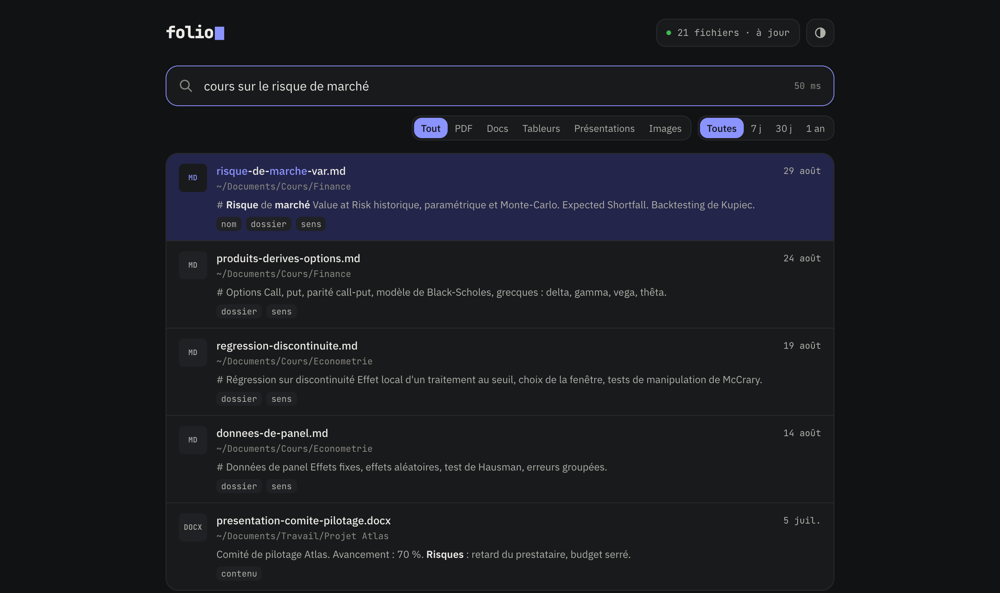

<div align="center">


**Local file search for macOS, in plain language.** Type what you remember
about a file — a topic, a client, a folder, a month — and folio finds it by
name, folder and content, in French or English.

[](https://github.com/ethanbch/folio/actions/workflows/ci.yml)
[](LICENSE)
[](#100-local)

</div>

---

```sh
npx folio-search
```

The first run installs folio's Python environment with
[uv](https://github.com/astral-sh/uv) (≈ 140 MB on disk; 2.3 s on a fast
connection), starts a local server and opens the page. uv is downloaded if
it is missing, and installs Python 3.13 if needed. Click **Index my files**.
After that, `npx folio-search` (or `folio` once installed with
`npm i -g folio-search`) opens the page in about a second.



## Table of contents

- [What it does](#what-it-does)
- [100% local](#100-local)
- [Keyboard](#keyboard)
- [How search works](#how-search-works)
- [Measured quality and speed](#measured-quality-and-speed)
- [Command line](#command-line)
- [Start at login and Dock app](#start-at-login-and-dock-app)
- [Permissions](#permissions)
- [Configuration](#configuration)
- [Limitations](#limitations)
- [Project structure](#project-structure)
- [Development](#development)
- [License](#license)

## What it does

- Searches file names, folder names and the text inside files: PDF, Word,
  PowerPoint, Excel and CSV, Markdown, text, code, notebooks, e-mails, EPUB,
  OpenDocument.
- Matches meaning, not only the words you type, with a multilingual
  embedding model running on your Mac.
- Reads dates and file types in the query, in French and English, and shows
  them as filters you can remove: "le pdf du devis de la semaine dernière"
  searches "devis" among PDFs modified since last Monday.
- Learns from what you open: a file you picked for a query ranks higher the
  next time.
- Updates the index within seconds of a change, at low priority, and pauses on
  battery below 20 %.

## 100% local

- The index lives in `~/Library/Application Support/folio/`.
- The server listens on `127.0.0.1` only.
- The only network access is the one-time download of the language model
  (two models, ≈ 240 MB from Hugging Face) and, if `uv` is missing, of `uv` itself. There is
  no telemetry.
- Searches and clicks are logged in the same local folder, to improve ranking.
  Nothing leaves your Mac.

## Keyboard

| Key | Action |
| --- | --- |
| type | Search as you type |
| `↑` `↓` | Select a result |
| `↵` | Open |
| `⌘` `↵` | Show in Finder |
| `⌘` `C` | Copy the path |
| `Space` | Quick Look preview (after `↑` or `↓`) |
| `Esc` | Clear the query |
| `⌘` `K` or `/` | Focus the search field |

## How search works

Each query goes through these steps, with no generative model involved:

1. **Parsing.** Rules extract dates ("hier", "en mars", "il y a 2 semaines",
   "last week", "2024") and types ("pdf", "excel", "présentation", "word"…).
   They become filters; the rest is the text to search.
2. **Keywords.** [tantivy](https://github.com/quickwit-oss/tantivy) searches
   three fields with a French analyzer (stemming, accents removed):
   name ×3, folders ×1.5, content ×1. Names are split before indexing:
   `rapport2024_finalV2` → `rapport 2024 final V 2`. One typo is tolerated in
   names and folders, and the word being typed matches as a prefix.
3. **Meaning.** [multilingual-e5-small](https://huggingface.co/intfloat/multilingual-e5-small)
   (int8, ONNX Runtime, on the CPU) embeds the query. Every file has one vector
   for its name and folders, plus one per chunk of ≈ 250 tokens of its first
   pages. Vectors are stored as int8 in a memory-mapped file and searched
   exhaustively, which is exact and takes a few milliseconds at this scale.
4. **Fusion.** Reciprocal Rank Fusion merges the two lists per file, with a
   small bonus when several chunks of a file match.
5. **Signals.** Recent modification and recent opening (`kMDItemLastUsedDate`),
   files opened from folio before, all query words in the name, and penalties
   for copies (`(1)`, `copie`) and archive folders.
6. **Re-ranking.** A multilingual cross-encoder
   ([mmarco-mMiniLMv2](https://huggingface.co/cross-encoder/mmarco-mMiniLMv2-L12-H384-v1))
   re-scores the top 10 with the query. The page shows the fast list at once
   and replaces it ≈ 60 ms later. Set `rerank = false` to save ≈ 135 MB of
   memory.

Every weight above was set by measurement, not by intuition: see
[docs/EVAL.md](docs/EVAL.md).

## Measured quality and speed

On an M3 MacBook Air (8 GB), with 4 408 files indexed (950 with readable
content, the rest stored in iCloud and indexed by name), over 61 queries
written the way one remembers a file (reranker on):

| | Value |
| --- | --- |
| Expected file in the top 3 | 84 % of queries |
| Expected file first | 70 % |
| Mean reciprocal rank | 0.783 |
| Query time, fast list (p95) | 12 ms |
| Query time, re-ranked list (p95) | 72 ms |
| Server memory, warm | ≈ 575 MB |
| First index, 4 408 files | 6 min 4 s (names searchable after 1.2 s) |
| Change picked up | 2.3 to 2.7 s |
| Install with `npx`, empty cache | 2.3 s |

The full comparison of variants is in [docs/EVAL.md](docs/EVAL.md).

## Command line

| Command | Does |
| --- | --- |
| `folio` | Opens the page, starting the server if needed |
| `folio serve` | Runs the server and the file watcher in the foreground |
| `folio index` | Indexes new and changed files (asks the running server if there is one) |
| `folio reindex` | Rebuilds the index |
| `folio search "query" --debug` | Searches from the terminal, with scores |
| `folio eval` | Measures ranking quality (MRR, recall@1/3/10, latency) |
| `folio sample` | Lists varied files to write evaluation queries for |
| `folio export-log` | Turns your searches followed by an open into evaluation queries |
| `folio doctor` | Checks permissions, folders, models and the index |
| `folio agent install` | Starts folio at login (launchd) |
| `folio reset` | Deletes the index and search history; models and configuration stay |
| `folio uninstall` | Deletes everything folio created on this Mac (your files are not touched) |

The index can also be deleted from the page: click the file count at the top
right, then **Delete index…**. folio then behaves as on its first launch: it
indexes nothing until you click **Index my files**.

## Start at login and Dock app

1. Run `folio agent install`. folio then starts at login, at background
   priority. `folio agent uninstall` removes it.
2. Open `http://127.0.0.1:7381` in Safari, then **File › Add to Dock**. folio
   becomes an app with its own window and icon. In Chrome: **⋮ › Cast, save and
   share › Install page as app**.

## Permissions

folio reads Documents, Desktop and Downloads, which macOS protects. The first
time, macOS asks to allow access for the terminal that runs folio. Full Disk
Access is not required for the default folders; grant it in **System Settings ›
Privacy & Security › Full Disk Access** if you add folders under `~/Library`.
`folio doctor` checks both.

## Configuration

`~/Library/Application Support/folio/config.toml` is created on first run,
with comments. The main settings:

| Setting | Default | Purpose |
| --- | --- | --- |
| `roots` | Documents, Desktop, Downloads | Folders to index |
| `icloud` | `true` | Also index iCloud Drive |
| `exclude_dirs`, `exclude_files` | build folders, caches, secrets | Never indexed |
| `max_content_mb` | `50` | Content is not read from larger files |
| `max_chunks_per_file` | `16` | Vectors per file (≈ 4 000 tokens) |
| `embedding_model` | `e5-small` | `e5-base` measured no better, ≈ 2.4× slower to index |
| `rerank` | `true` | Cross-encoder re-ranking of the top 10 |
| `port` | `7381` | Local server port |

Files that usually hold secrets (`kaggle.json`, `*.pem`, SSH keys,
`credentials*.json`, keychains) are excluded by default, so their content
never appears in an excerpt.

## Limitations

- **iCloud files that are not downloaded are found by name and folder only.**
  Reading them would download them. With "Optimize Mac Storage" on, this is
  most of Desktop and Documents.
- Scanned PDFs without a text layer are found by name only (no OCR).
- Long documents get vectors for their first ≈ 4 000 tokens; the rest of the
  text is searched by keywords.
- macOS only.

## Project structure

| Path | Role |
| --- | --- |
| `bin/folio.mjs` | npm launcher: installs the Python environment with uv, runs folio |
| `src/folio/crawl.py` | Folder walk and exclusions |
| `src/folio/extract.py` | Text extraction in worker processes, with a timeout |
| `src/folio/indexer.py` | Incremental pipeline: metadata, names, content, vectors |
| `src/folio/lexical.py` | tantivy schema, French analyzer, query building |
| `src/folio/models.py` | ONNX embedding model and cross-encoder |
| `src/folio/vectors.py` | int8 vector file, read through mmap |
| `src/folio/queryparse.py` | Dates and file types in French and English |
| `src/folio/engine.py` | Retrieval, fusion, ranking signals, excerpts |
| `src/folio/server.py` | Local server, CSRF and DNS-rebinding protection |
| `src/folio/watcher.py` | FSEvents watcher with debounce |
| `src/folio/evaluate.py` | `folio eval`, `sample`, `export-log` |
| `src/folio/web/` | The page: HTML, CSS and JavaScript, no build step |

## Development

```sh
uv sync
uv run folio serve                          # http://127.0.0.1:7381
uv run pytest
uv run ruff check src tests
uv run python scripts/demo.py /tmp/demo     # fictional files to try folio on
node scripts/screenshot.mjs <url> out.png   # screenshot through Chrome DevTools
```

The interface follows the Readout design system: neutral surfaces, one indigo
accent, IBM Plex Sans for text and JetBrains Mono for paths, dates and figures.
Fonts are bundled, so the page makes no request outside your Mac.

## License

MIT. IBM Plex Sans and JetBrains Mono are under the SIL Open Font License
(`src/folio/web/OFL-*.txt`).
